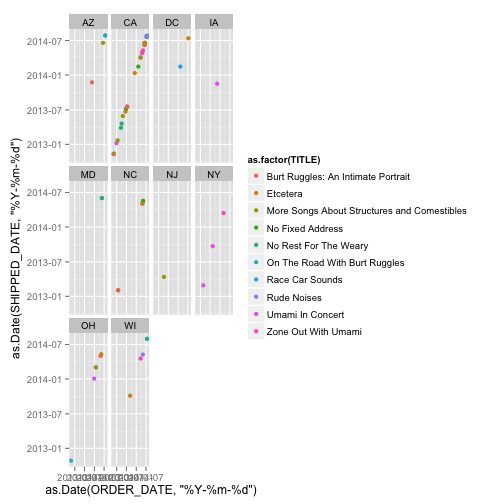
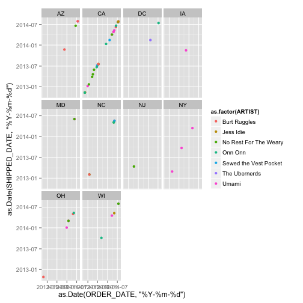

# __CS 329E: Project 1__

Due: February 4, 2015

Students: Jiannan Zhang & Jaclyn Nguyen

========================================================

This project required us to pull data from a RestfulReL server and explore the data. Below shows the step by step process of exploring and reproducing the required visualization for Project1 Requirements.


__1. Loading of necessary R packages: RCurl, ggplot2 (R code not shown)__


__2. Creation of data frames for each data set: "df_cust","df_orders", "df_ord_details", "df_items"__


```r
# data frame #1 (df1)
source("../Data/df_cust.R", echo = TRUE)
```

```
## 
## > df_cust <- data.frame(eval(parse(text = substring(getURL(URLencode("http://129.152.144.84:5001/rest/native/?query=\"select * from customers\""), 
## +  .... [TRUNCATED]
```
Below shows a sample of the data set "df_cust" and a ggplot representing
the customers and the state in which they reside in.


```r
head(df_cust)
```

```
##   CUSTOMER_ID CUSTOMER_FIRST_NAME CUSTOMER_LAST_NAME      CUSTOMER_ADDRESS
## 1           1               Korah             Blanca       1555 W Lane Ave
## 2           2                Yash            Randall 11 E Rancho Madera Rd
## 3           3           Johnathon          Millerton        60 Madison Ave
## 4           4             Mikayla             Damion      2021 K Street Nw
## 5           5             Kendall              Mayte 4775 E Miami River Rd
## 6           6             Kaitlin           Hostlery 3250 Spring Grove Ave
##   CUSTOMER_CITY CUSTOMER_STATE CUSTOMER_ZIP CUSTOMER_PHONE CUSTOMER_FAX
## 1      Columbus             OH        43221     6145554432   6145553920
## 2       Madison             WI        53707     2095551205   2095552262
## 3      New York             NY        10010     2125554800         NULL
## 4    Washington             DC        20006     2025555561         NULL
## 5        Cleves             OH        45002     5135553024         NULL
## 6    Cincinnati             OH        45225     8005552128   8005552640
```

```r
# plot1 part A for df_cust
source("../Visualizations/plot1pta.R", echo = TRUE)
```

```
## 
## > ggplot(df_cust, aes(x = CUSTOMER_STATE, y = CUSTOMER_LAST_NAME)) + 
## +     geom_point()
```

 

```r
#plot1 part B recreates visual above, but using a histogram instead to repsent the data
source("../Visualizations/plot1ptb.R", echo = TRUE)
```

```
## 
## > ggplot(data = df_cust) + geom_histogram(aes(x = CUSTOMER_STATE))
```

 

Below shows a sample of the data set "df_orders" and a ggplot representing
the customers and their associated order id number.

```r
# data frame #2 (df2)
source("../Data/df_orders.R", echo = TRUE)
```

```
## 
## > df_orders <- data.frame(eval(parse(text = substring(getURL(URLencode("http://129.152.144.84:5001/rest/native/?query=\"select * from orders\""), 
## +   .... [TRUNCATED]
```

```r
head(df_orders)
```

```
##   ORDER_ID CUSTOMER_ID          ORDER_DATE        SHIPPED_DATE
## 1       19           1 2012-10-23 00:00:00 2012-10-28 00:00:00
## 2       29           8 2012-11-05 00:00:00 2012-11-11 00:00:00
## 3       32          11 2012-11-10 00:00:00 2012-11-13 00:00:00
## 4       45           2 2012-11-25 00:00:00 2012-11-30 00:00:00
## 5       70          10 2012-12-28 00:00:00 2013-01-07 00:00:00
## 6       89          22 2013-01-20 00:00:00 2013-01-22 00:00:00
```

```r
# plot2 for df_orders
source("../Visualizations/plot2.R", echo = TRUE)
```

```
## 
## > ggplot(df_orders, aes(x = CUSTOMER_ID, y = ORDER_ID, 
## +     color = as.factor(CUSTOMER_ID))) + geom_point()
```

 

Below shows a sample of the data set "df_ord_detail" and a ggplot representing the item number and the order quantity. Each point represents one order, where the y-axis showcases the quatitiy per order.

```r
# data frame #3 (df3)
source("../Data/df_ord_details.R", echo = TRUE)
```

```
## 
## > df_ord_details <- data.frame(eval(parse(text = substring(getURL(URLencode("http://129.152.144.84:5001/rest/native/?query=\"select * from order_detai .... [TRUNCATED]
```

```r
#plot3
source("../Visualizations/plot3.R", echo = TRUE)
```

```
## 
## > ggplot(df_ord_details, aes(x = ITEM_ID, y = ORDER_QTY)) + 
## +     geom_point() + scale_x_discrete(breaks = df_ord_details$ITEM_ID)
```

 

Below shows a sample of the data set "df_items" and a ggplot representing
the item number, pricing, and artist association.

```r
# Data Frame #4 (df4)
source("../Data/df_items.R", echo = TRUE)
```

```
## 
## > df_items <- data.frame(eval(parse(text = substring(getURL(URLencode("http://129.152.144.84:5001/rest/native/?query=\"select * from items\""), 
## +     .... [TRUNCATED]
```

```r
#plot4
source("../Visualizations/plot4.R", echo = TRUE)
```

```
## 
## > ggplot(df_items, aes(x = ITEM_ID, y = UNIT_PRICE, 
## +     color = ARTIST)) + geom_point() + scale_x_discrete(breaks = df_items$ITEM_ID)
```

 

__3. The next R code merges the four data frames into one data frame that allows us to reproduce the visuals from Project 1 Requirements__

```r
source("../Data/df_main.R", echo = TRUE)
```

```
## 
## > df_main <- df <- data.frame(eval(parse(text = substring(getURL(URLencode("http://129.152.144.84:5001/rest/native/?query=\"select * from orders o joi .... [TRUNCATED]
```

```r
# plot1 based on Unit Price
source("../Visualizations/plot1up.R", echo = TRUE)
```

```
## 
## > ggplot(df_main, aes(x = as.Date(ORDER_DATE, "%Y-%m-%d"), 
## +     y = as.Date(SHIPPED_DATE, "%Y-%m-%d"), color = as.factor(UNIT_PRICE))) + 
## +     geom .... [TRUNCATED]
```

 

```r
# plot2 based on TITLE
source("../Visualizations/plot1title.R", echo = TRUE)
```

```
## 
## > ggplot(df_main, aes(x = as.Date(ORDER_DATE, "%Y-%m-%d"), 
## +     y = as.Date(SHIPPED_DATE, "%Y-%m-%d"), color = as.factor(TITLE))) + 
## +     geom_poin .... [TRUNCATED]
```

 

```r
# plot3 based on ARTIST
source("../Visualizations/plot1artist.R", echo = TRUE)
```

```
## 
## > ggplot(df_main, aes(x = as.Date(ORDER_DATE, "%Y-%m-%d"), 
## +     y = as.Date(SHIPPED_DATE, "%Y-%m-%d"), color = as.factor(ARTIST))) + 
## +     geom_poi .... [TRUNCATED]
```

 


