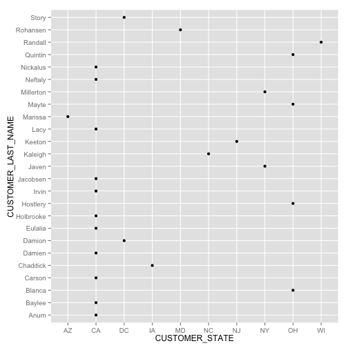
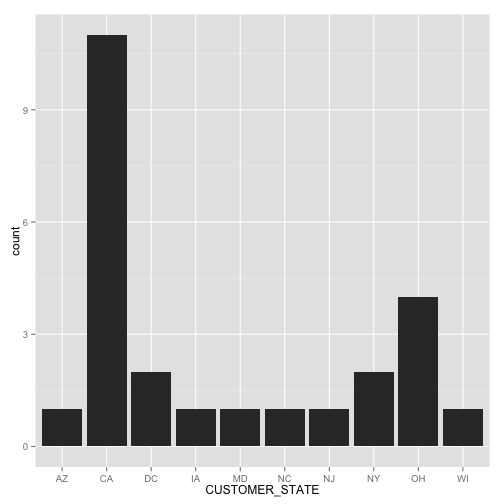
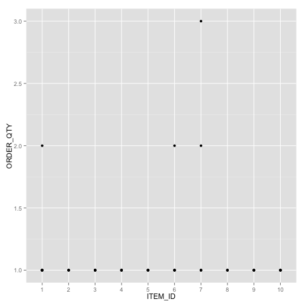
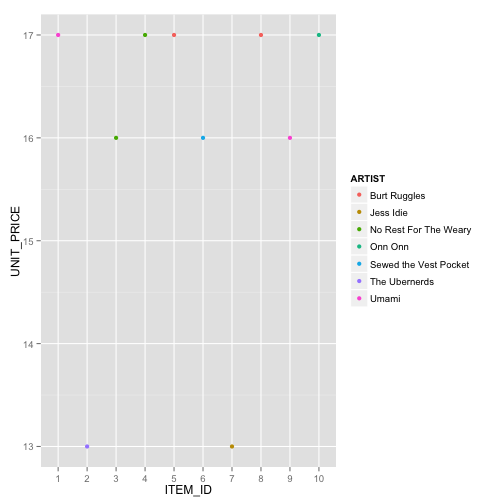
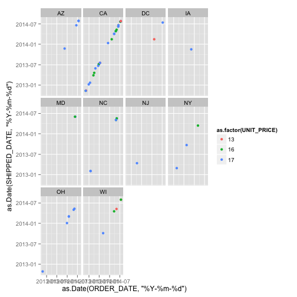
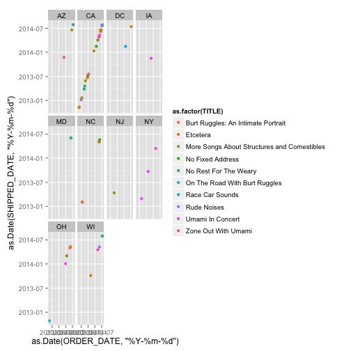
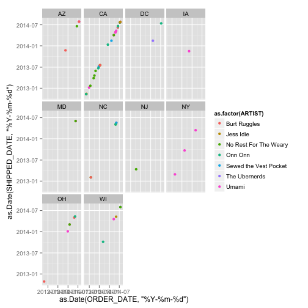

# __CS 329E: Project 1__

Due: February 4, 2015

Students: Jiannan Zhang & Jaclyn Nguyen

========================================================

This is an R Markdown document. Markdown is a simple formatting syntax for authoring web pages (click the **Help** toolbar button for more details on using R Markdown).

When you click the **Knit HTML** button a web page will be generated that includes both content as well as the output of any embedded R code chunks within the document. You can embed an R code chunk like this:


```r
library(RCurl)
```

```
## Loading required package: bitops
```

```r
library (ggplot2)
```

```r
# df1
df_cust <- data.frame(eval(parse(text=substring(getURL(URLencode('http://129.152.144.84:5001/rest/native/?query="select * from customers"'), httpheader=c(DB='jdbc:oracle:thin:@129.152.144.84:1521/PDB1.usuniversi01134.oraclecloud.internal', USER='DV_ORDERS', PASS='orcl', MODE='native_mode', MODEL='model', returnFor = 'R', returnDimensions = 'False'), verbose = TRUE), 1, 2^31-1))))
head(df_cust)
```

```
##   CUSTOMER_ID CUSTOMER_FIRST_NAME CUSTOMER_LAST_NAME      CUSTOMER_ADDRESS
## 1           1               Korah             Blanca       1555 W Lane Ave
## 2           2                Yash            Randall 11 E Rancho Madera Rd
## 3           3           Johnathon          Millerton        60 Madison Ave
## 4           4             Mikayla             Damion      2021 K Street Nw
## 5           5             Kendall              Mayte 4775 E Miami River Rd
## 6           6             Kaitlin           Hostlery 3250 Spring Grove Ave
##   CUSTOMER_CITY CUSTOMER_STATE CUSTOMER_ZIP CUSTOMER_PHONE CUSTOMER_FAX
## 1      Columbus             OH        43221     6145554432   6145553920
## 2       Madison             WI        53707     2095551205   2095552262
## 3      New York             NY        10010     2125554800         NULL
## 4    Washington             DC        20006     2025555561         NULL
## 5        Cleves             OH        45002     5135553024         NULL
## 6    Cincinnati             OH        45225     8005552128   8005552640
```

```r
# plot1 for df_cust
ggplot (df_cust, aes(x = CUSTOMER_STATE, y = CUSTOMER_LAST_NAME)) + geom_point()
```

 

```r
ggplot (data = df_cust) + geom_histogram(aes(x = CUSTOMER_STATE))
```

 

```r
#df2
df_orders <- data.frame(eval(parse(text=substring(getURL(URLencode('http://129.152.144.84:5001/rest/native/?query="select * from orders"'), httpheader=c(DB='jdbc:oracle:thin:@129.152.144.84:1521/PDB1.usuniversi01134.oraclecloud.internal', USER='DV_ORDERS', PASS='orcl', MODE='native_mode', MODEL='model', returnFor = 'R', returnDimensions = 'False'), verbose = TRUE), 1, 2^31-1))))
head(df_orders)
```

```
##   ORDER_ID CUSTOMER_ID          ORDER_DATE        SHIPPED_DATE
## 1       19           1 2012-10-23 00:00:00 2012-10-28 00:00:00
## 2       29           8 2012-11-05 00:00:00 2012-11-11 00:00:00
## 3       32          11 2012-11-10 00:00:00 2012-11-13 00:00:00
## 4       45           2 2012-11-25 00:00:00 2012-11-30 00:00:00
## 5       70          10 2012-12-28 00:00:00 2013-01-07 00:00:00
## 6       89          22 2013-01-20 00:00:00 2013-01-22 00:00:00
```

```r
# plot2 for df_orders
ggplot(df_orders, aes(x = CUSTOMER_ID, y = ORDER_ID, color = CUSTOMER_ID)) + geom_point()
```

 

```r
#df3
df_ord_details <- data.frame(eval(parse(text=substring(getURL(URLencode('http://129.152.144.84:5001/rest/native/?query="select * from order_details"'), httpheader=c(DB='jdbc:oracle:thin:@129.152.144.84:1521/PDB1.usuniversi01134.oraclecloud.internal', USER='DV_ORDERS', PASS='orcl', MODE='native_mode', MODEL='model', returnFor = 'R', returnDimensions = 'False'), verbose = TRUE), 1, 2^31-1))))

#plot3
ggplot(df_ord_details, aes(x = ITEM_ID, y = ORDER_QTY)) + geom_point() + scale_x_discrete(breaks=df_ord_details$ITEM_ID)
```

 

```r
#hist(df_ord_details$ITEM_ID)

#df4
df_items <- data.frame(eval(parse(text=substring(getURL(URLencode('http://129.152.144.84:5001/rest/native/?query="select * from items"'), httpheader=c(DB='jdbc:oracle:thin:@129.152.144.84:1521/PDB1.usuniversi01134.oraclecloud.internal', USER='DV_ORDERS', PASS='orcl', MODE='native_mode', MODEL='model', returnFor = 'R', returnDimensions = 'False'), verbose = TRUE), 1, 2^31-1))))

#plot4
ggplot(df_items, aes(x = ITEM_ID, y = UNIT_PRICE, color = ARTIST)) + geom_point() + scale_x_discrete(breaks = df_items$ITEM_ID)
```

 

```r
df_main <- df <- data.frame(eval(parse(text=substring(getURL(URLencode('http://129.152.144.84:5001/rest/native/?query="select * from orders o join customers c on o.customer_id = c.customer_id join order_details d on o.order_id = d.order_id join items i on d.item_id = i.item_id"'), httpheader=c(DB='jdbc:oracle:thin:@129.152.144.84:1521/PDB1.usuniversi01134.oraclecloud.internal', USER='DV_ORDERS', PASS='orcl', MODE='native_mode', MODEL='model', returnFor = 'R', returnDimensions = 'False'), verbose = TRUE), 1, 2^31-1))))

# plot1 based on UP
ggplot(df_main, aes(x = as.Date(ORDER_DATE,"%Y-%m-%d"), y = as.Date(SHIPPED_DATE,"%Y-%m-%d"), color = as.factor(UNIT_PRICE)) ) + geom_point() + facet_wrap(~CUSTOMER_STATE)
```

```
## Warning: Removed 4 rows containing missing values (geom_point).
```

```
## Warning: Removed 1 rows containing missing values (geom_point).
```

```
## Warning: Removed 2 rows containing missing values (geom_point).
```

 

```r
# plot2 based on TITLE
ggplot(df_main, aes(x = as.Date(ORDER_DATE,"%Y-%m-%d"), y = as.Date(SHIPPED_DATE,"%Y-%m-%d"), color = as.factor(TITLE)) ) + geom_point() + facet_wrap(~CUSTOMER_STATE)
```

```
## Warning: Removed 4 rows containing missing values (geom_point).
```

```
## Warning: Removed 1 rows containing missing values (geom_point).
```

```
## Warning: Removed 2 rows containing missing values (geom_point).
```

 

```r
# plot3 based on ARTIST
ggplot(df_main, aes(x = as.Date(ORDER_DATE,"%Y-%m-%d"), y = as.Date(SHIPPED_DATE,"%Y-%m-%d"), color = as.factor(ARTIST)) ) + geom_point() + facet_wrap(~CUSTOMER_STATE)
```

```
## Warning: Removed 4 rows containing missing values (geom_point).
```

```
## Warning: Removed 1 rows containing missing values (geom_point).
```

```
## Warning: Removed 2 rows containing missing values (geom_point).
```

 


